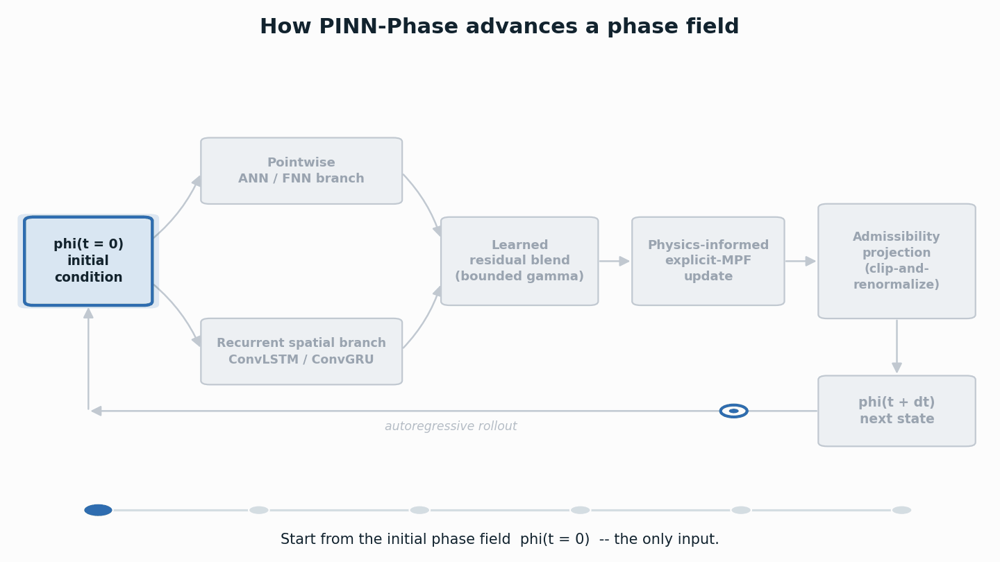
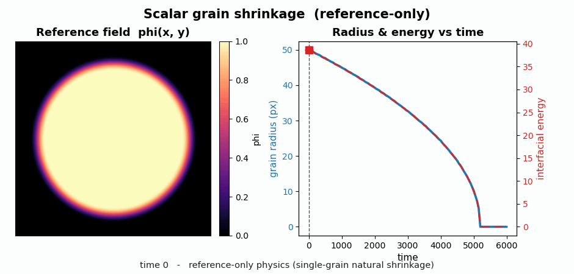
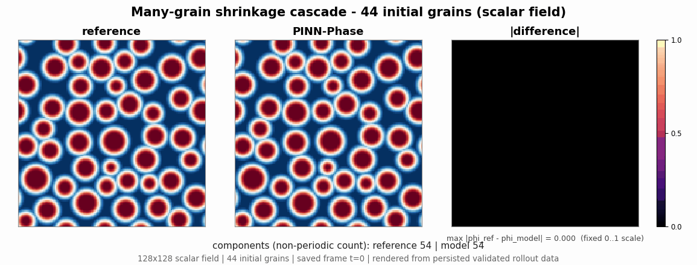
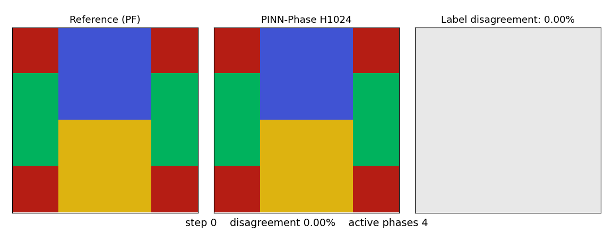
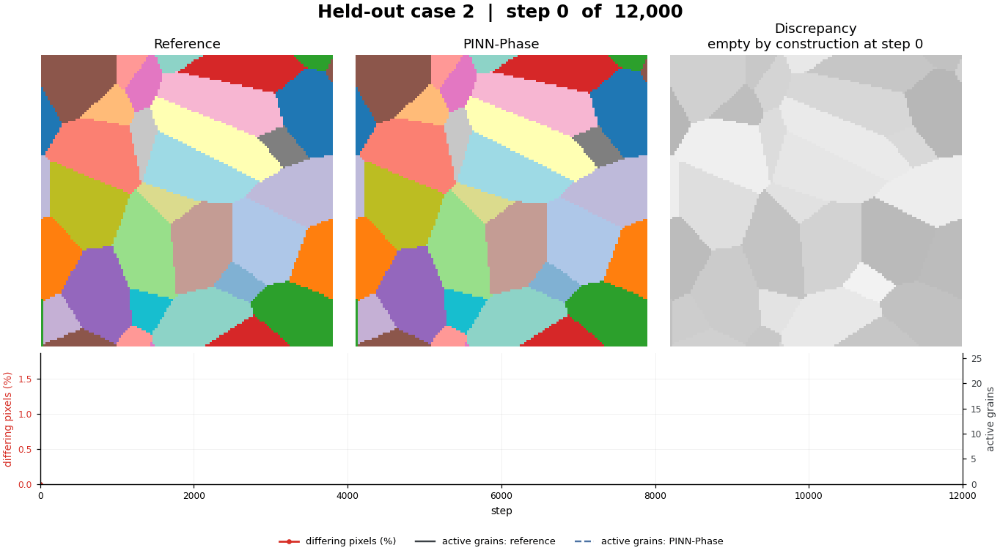
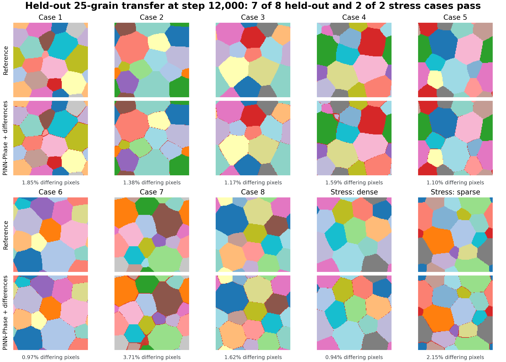
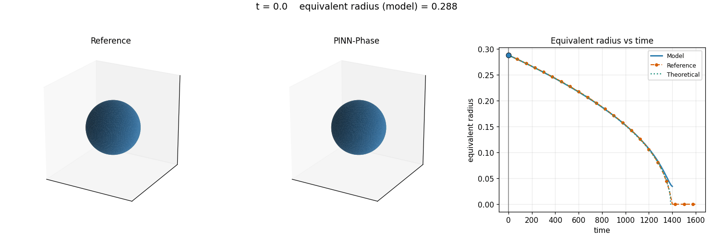
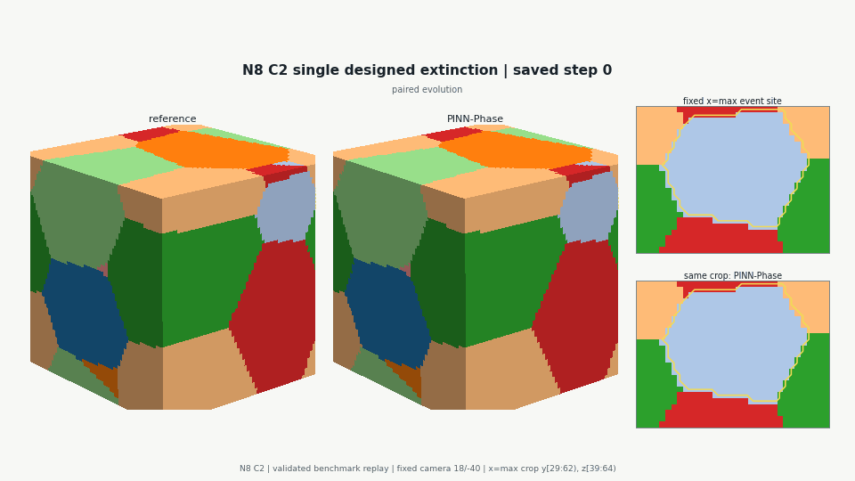
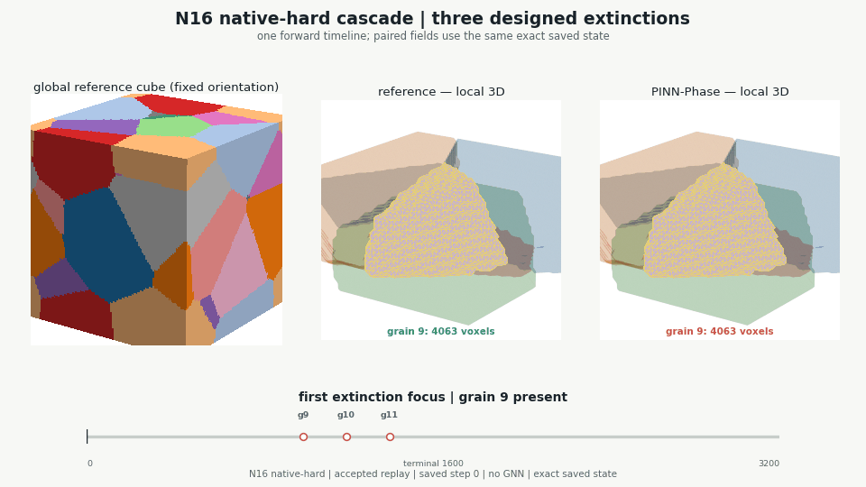
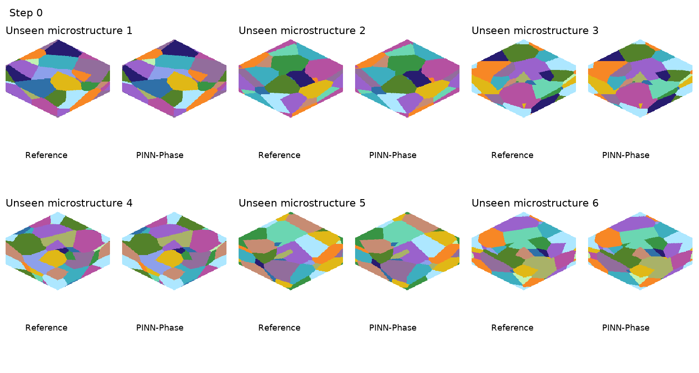

# PINN-Phase

**Physics-informed neural time integrators for curvature-driven phase-field
evolution.**

PINN-Phase advances an initial phase field one admissible neural step at a time,
capturing growth, shrinkage, extinction, and topology change in two- and
three-dimensional designed benchmarks. The two-dimensional evaluations extend
to 12,000 autonomous steps. For the reported explicit-MPF models, the physical
training target is evaluated on the model's own evolving field; post-initial
reference states are reserved for evaluation rather than used as step targets.

The benchmarks below form a **progressive ladder**, in the order the study was
built: a single scalar interface, then multiphase relaxation and 2D coarsening,
then a dense 64-grain field, then a prospectively fixed test on microstructures
the model has never seen, and finally three dimensions. Each rung adds one kind
of difficulty — a dimension, a phase count, a topology event, or an unseen
initial condition.

The repository includes scalar and explicit multiphase-field benchmarks,
first-generation and permutation-equivariant model families, hash-first artifact
loading, and a prospectively fixed transfer study whose complete score can be
recomputed from 2.6 MB of shipped data.

**New to the model?** Start with the eight-part
[physics-first tutorial series](docs/tutorials/README.md), from diffuse-interface
foundations and the explicit MPF operator through training, symmetry,
long-horizon topology, and replay. [`docs/README.md`](docs/README.md) maps the
rest of the scientific and reproducibility documentation.


## How PINN-Phase advances a phase field

<p align="center">
  
</p>

Each update advances `phi(t) -> phi(t+dt)` and feeds the result back as the next
input:

- **Two views of the field.** A pointwise branch produces a site-local
  response; a convolutional recurrent branch produces a spatially coherent
  response.
- **A learned blend.** A learned coefficient blends the two branch responses
  into a single response.
- **A bounded, zero-sum increment.** In the accepted, currently-distributed
  configurations the blended response is squashed, scaled, and phase-centered
  into a bounded increment that sums to zero across phases; the model class
  also permits an older, unbounded parameterization that no shipped checkpoint
  uses (see
  [`docs/tutorials/04_one_pinn_phase_step.md`](docs/tutorials/04_one_pinn_phase_step.md)).
- **An explicit update step.** The increment advances the field — this step
  does not evaluate the physical multiphase-field operator, which supplies the
  training target
  only ([`docs/tutorials/05_physics_informed_training.md`](docs/tutorials/05_physics_informed_training.md)).
- **A valid microstructure.** An admissibility map keeps the field
  physical (`phi` in `[0,1]`, `sum(phi) = 1`) across a long rollout.

The animation shows the **first-generation hybrid model**, the family behind the
junction and the three-dimensional cubes, in its hard clip-and-renormalize
configuration. The **permutation-equivariant model** used for the 25-grain and
64-grain results keeps this autonomous, physics-guided loop but replaces the
per-phase branches with a shared encoder and symmetric aggregation, so
relabelling the phases relabels the output channels accordingly without
changing the physical prediction. It
carries 9,605 parameters. Full method:
[`docs/METHOD_OVERVIEW.md`](docs/METHOD_OVERVIEW.md).

---

## Rollout, temporal extrapolation, and generalisation

PINN-Phase is evaluated along two independent axes: **time** and **initial
condition**.

```text
Development initial condition phi_0(dev)
        |
        | physics-residual training on the model's own rollout
        | represented rollout horizon H
        v
  frozen checkpoint
        |
        +-- development IC: autonomous rollout  0 -------- H -------- T
        |                                      represented   extrapolation
        |
        +-- unseen IC phi_0(k), k = 1,...,m
              same frozen weights, no retraining or adaptation
              direct autonomous rollout, evaluated within or beyond H
```

- **Autonomous rollout** repeatedly feeds each predicted state into the next
  model step.
- **Temporal extrapolation** continues that rollout beyond the represented
  training horizon `H`.
- **Initial-condition generalisation** applies the same frozen model directly
  to an unseen initial condition.

An unseen-case evaluation may stay within `H`, or it may test generalisation
and temporal extrapolation together.

---

## Scalar interface motion and topology change

The first rung drops phase identities entirely and asks whether a single interface
can be moved correctly, and then let a domain vanish. Note that this rung exercises
the **reference solver**, not a trained model: the 0.997% below is the solver's
fidelity against the analytic radius-squared law, and it is the one number on this
page you can regenerate end to end from the repository.

<p align="center">
  
</p>

A circular grain shrinks under curvature flow, and its area falls linearly in
time — the radius-squared law. This case ships complete and regenerates locally
in seconds:

```bash
python scripts/reproduce_scalar_reference.py
```

The reproduction recovers the pre-extinction radius-squared slope to **0.997%**
relative error, with monotone sampled energy.

**Many-grain shrinkage cascade** — a 44-grain field coarsening to a single domain
across 41 saved frames.

<p align="center">
  
</p>

Given only the initial field, the model reproduces the whole coarsening cascade
down to one domain on a periodic domain, matching the reference's thresholded
component count at every saved frame, with differences staying small and
interface-localized. Component counts describe the topology of a thresholded
field; they are not persistent grain labels.

---

## Multiphase relaxation and two-dimensional coarsening

The second rung restores explicit phase identities, so grains can now be tracked,
mistaken for one another, or lost.

**Four-phase junction relaxation** — a four-phase field relaxed to step 6,000.

<p align="center">
  
</p>

Equilibrium junction angles are a standard multiphase-field benchmark. Starting
from a right-angle configuration, the model relaxes toward the equal-energy
geometry and holds it: terminal label disagreement is **3.27%** against a 6.54%
persistence baseline, all four phases stay active, and the junction angles reach
127.8°, 115.9°, and 116.4° — an RMS deviation of 5.5° from 120°.

### The 25-grain cascade

The permutation-equivariant model was trained on one 25-grain initial condition
with a 4,096-step horizon and then run autonomously on it for 12,000 steps; the
final 7,904 steps lie beyond the horizon it was trained with.

<p align="center">
  
</p>

The diagnostic panel beneath the fields is divided at step **4,096**, the
horizon the model was trained with, and labels both sides in the figure itself:
everything left of the mark is **within the represented training horizon**, and
the **7,904 steps** to its right are **autonomous extrapolation** beyond it — the
same division the 64-grain animation below draws at its own horizon of 8,192.
The whole rollout is autonomous, and the mark describes only the rollout's
relation to training: "within the represented horizon" does not mean the model
was shown these states, and training used no reference frames after step 0. The
phase-field reference is drawn complete as a held-out comparator used for
evaluation only; only the rollout advances.

Twenty-five grains coarsen to sixteen. The model ends **1.46%** of pixels away
from the reference, against a persistence floor of **44.37%**, and recovers the
**exact 16-grain terminal survivor set** — no grain lost that should have
survived, none kept that should have died. At step 4,000 the figures are
**0.81%** against a **26.59%** floor.

The same frozen weights, with no retraining or tuning, were then run on a
*different* development initial condition: **0.95%** at step 4,000 against a
**28.97%** floor, **1.13%** at step 12,000 against **51.25%**, the exact 12-grain
terminal set, and all 13 reference extinctions reproduced.

**Both cases are development evidence.** The model was trained on the first and
the second was chosen from the same development suite, so neither is a
prospectively fixed test — that comes further down the ladder. The active-grain
count tracks the reference at every audited cadence step but one in each case.

**The disclosed failure.** The pre-registered timing anchor does **not** pass.
Extinction events are systematically **premature**: the model tends to remove a
grain before the reference does, with median residuals of −53 steps on the
training case and −85 on the second. Terminal survivor sets are exact; the timing
of getting there is not.

---

## Dense 64-grain coarsening

The largest phase-count, long-horizon two-dimensional benchmark on the ladder.

**The registered primary result.** The model was trained with a 4,096-step
horizon, frozen, and evaluated once against criteria fixed beforehand. Rolling
autonomously from one 128², 64-grain initial condition, it reaches **1.35%**,
**3.50%**, and **6.09%** differing pixels at steps 4,000, 8,000, and 12,000. The
persistence floor at step 12,000 is **69.89%**. The reference retains 21 grains;
the prediction retains those same 21 plus one additional grain, giving a terminal
survivor F1 of **0.9767** with **no false deaths and no reappearances**: all 21
true survivors are retained, and the single discrepancy is one additional
retained grain.

**A post-evaluation sensitivity run.** After the registered primary evaluation,
training was continued for 25 additional epochs with the represented horizon
extended from 4,096 to 8,192 steps. The resulting checkpoint was then rolled
autonomously to step 12,000. The final 3,808 steps therefore test extrapolation
beyond its represented training horizon; no post-t0 reference states were used
for training.

<p align="center">
  
</p>

The diagnostic panel beneath the fields is divided at step **8,192** and labels
both sides in the figure itself: everything left of the mark is **within the
represented training horizon**, and the **3,808 steps** to its right are
**autonomous extrapolation** beyond it. The whole rollout is autonomous — the
label distinguishes the horizon represented during training from the interval
past it, not a supervised stretch from an unsupervised one.

The boundary describes the rollout's relation to training and nothing else: there
is no restart and no physical discontinuity there, and nothing about the field
panels changes as it is crossed. The phase-field reference is the fixed backdrop
of the panel: it is drawn complete, does not move, and spans the boundary as a
**held-out comparator used for evaluation only** — it was never supplied to the
model, inside the represented horizon or outside it. Only the rollout advances,
so what travels across the panel is the model's own trajectory and its
disagreement with that comparator.

The run reaches **0.85%**, **2.07%**, and **3.97%** at the same three milestones,
recovers the **exact 21-grain terminal survivor set**, and matches **43 of 43**
reference extinctions by identity.

Read that second run for what it is. It is a **sensitivity study of one design
choice, carried out after the evaluation had finished** — not an independent
confirmation, and not the registered result. The horizon and the additional
training effort co-vary, so the improvement cannot be attributed to the horizon
alone. The registered primary outcome above is the one that was scored once
against criteria fixed in advance.

Both are **one initial condition and one seed**. The large fields are not
distributed in v0.1; their SHA-256 identities, and those of the arrays behind the
animation, are recorded in
[`docs/COMPLETED_EVIDENCE_LEDGER.md`](docs/COMPLETED_EVIDENCE_LEDGER.md).

---

## Prospective generalization to unseen initial conditions

Every rung so far is a development benchmark: the model was trained on that
initial condition, or the case was drawn from the same development suite. They
measure fidelity on development initial conditions. Whether the frozen model
transfers to unseen initial conditions is a separate question, answered by an
evaluation fixed before the result is known.

The primary model was trained from **a single initial condition**, frozen, and
run autonomously for 12,000 steps on **ten microstructures it had never seen** —
eight drawn from the same generator as training, plus two deliberately harder
*stress cases* with denser and sparser grain structures. Criteria and the cohort
bar were fixed in advance, and there was **one scoring pass**. It passed every criterion
on **7 of the 8 unseen cases and both harder cases**. A secondary model trained
from six initial conditions reached the same counts; it corroborates the primary
and can neither rescue nor veto it.

<p align="center">
  
</p>

A representative unseen case: twenty-five grains coarsen to thirteen, the model
reaches the same thirteen, and it ends with **1.38% of pixels differing** from a
reference it never saw. The discrepancy panel is empty at step 0 by construction
— that frame is the shared initial condition — and the differences that follow
stay localized on the grain boundaries.

<p align="center">
  
</p>

All ten cases at step 12,000. Across the seven passing unseen cases, terminal
differences run from **0.97% to 1.85%** of pixels, against persistence baselines
of 32% to 49%; both harder cases pass, at 0.94% and 2.15%. Every case is
structurally valid, no case shows a grain reappearing after disappearing, and
every case places its differing pixels inside the diffuse-interface region.

**The one case that fails.** Case 7 is the single strict failure, and it stays
counted. The model removes one grain before step 12,000 while the reference still
holds it — a *false death*, which the frozen criteria treat as disqualifying no
matter how good the rest of the field looks. Terminal agreement for that case is
still 96.3% and its survivor F1 is 0.9677. In a separately registered descriptive
tail, the reference removes the same grain at step 12,933, 933 steps past the
horizon. **This does not rescue the result.** The horizon was fixed before
scoring, information after it cannot change a strict verdict, and the score stays
7 of 8.

Recompute the entire score — every archive hash, every per-case metric, every
gate — from the shipped data:

```bash
python scripts/reproduce_n25_transfer.py
```

**What this does and does not establish.** It establishes transfer to unseen
initial conditions within one fixed family of 25-grain coarsening problems: same
generator, resolution, and physics. It does not establish transfer across
materials, operators, phase counts, resolutions, or dimensions. Seven of eight is
a pass at the threshold registered in advance, not evidence of headroom — the 95%
interval on that proportion runs from 0.53 to 0.98. An earlier 6-of-8 development
campaign exists; it is separate evidence and is never pooled with this cohort.
Details, gate definitions, and scope:
[`benchmarks/n25_transfer/README.md`](benchmarks/n25_transfer/README.md).

---

## Three-dimensional progression

The last rung adds a dimension. Every frame below is an exact saved state.

**Curvature-driven spherical-grain shrinkage** — a single grain shrinking in 3D.

<p align="center">
  
</p>

Reference and PINN-Phase shrink the sphere in lockstep; the equivalent-radius
slope is **0.991** times the reference slope (fit R² 0.9999). This establishes
three-dimensional feasibility for the scalar model, under explicit bound
enforcement — the outcome depends on which bound-enforcement scheme is used.

**Read this rung under a different protocol.** It is the one result on this page
whose weights were selected with a physical-audit score containing post-`t0`
reference terms, so it does not support the scoped post-initial-condition
physics-training claim made for the rest of the ladder. Its checkpoint is not
distributed and the result is
provenance-only: the archive records its identity and does not imply you can
recompute it here. See "Scope and limitations" and
[`docs/REPRODUCTION_LEVELS.json`](docs/REPRODUCTION_LEVELS.json).

**Single-extinction eight-phase cube** — a 64³ volume through one designed
extinction.

<p align="center">
  
</p>

The designed grain shrinks and disappears. At step 2,000 the model reaches
**99.533%** label agreement against a 94.01% persistence baseline, recovers the
exact seven-grain survivor set with no spurious or missing phase, and places the
extinction one saved frame after the reference event.

**Three-extinction sixteen-phase cube** — a 96³ volume carried along one forward
timeline through three designed extinctions.

<p align="center">
  
</p>

A fixed global cube locates the three event regions while paired local views show
three grains disappearing in turn at saved steps 1,000, 1,200, and 1,400.
Terminal agreement at step 1,600 is **99.668%**, with the exact thirteen-grain
survivor set and all three extinctions matched at the 200-step saved-frame
resolution.

Both cubes are **individual designed cases**, chosen to contain specific topology
events. They are validated single benchmarks, not statistical tests of
three-dimensional grain-growth kinetics, and extinction timing is only ever
claimed at the resolution of the saved frames.

**Prospective cohort:** six unseen N=16, 96³ initial microstructures, evaluated with the same fixed model.

<p align="center">
  
</p>

On six prospectively fixed unseen N=16, 96³ initial microstructures, the same fixed model reaches 95.06–95.83% label agreement at step 1600, recovers the exact 13-grain terminal active set and all three extinction identities in all six cases, and meets the complete predefined qualification in five of six. This is within-family initial-condition transfer at fixed phase count and resolution, not evidence of transfer across materials, resolutions or phase counts. The animation shows all six cases and all 17 saved states; step 1600 is the terminal evaluation and later frames are monitored continuation. See [`benchmarks/n16_96_transfer/README.md`](benchmarks/n16_96_transfer/README.md) for the complete contract and the narrowly defined two unmet conditions for Unseen microstructure 5.

**Inside one unseen cube:** one case from the cohort, selected by a fixed rule.

<p align="center">
  
</p>

In the cohort grid above, each case occupies a small paired view with a fixed corner cutaway, and interior topology events are hard to read at that scale. Here one case — Unseen microstructure 3, selected by a fixed rule as the case whose three disappearing grains all have zero voxels on the rendered faces at their last saved appearance — is shown at full size: each row pairs the intact exterior of the cube with an interior view in which only the three disappearing grains are rendered, inside a wireframe outline (Grain 1-3 denotes reference disappearance order; Grains 2 and 3 are first absent at the same saved step in the reference). Two of the three grains appear on the rendered faces early in the run and withdraw from them as they shrink; at its last saved appearance each grain has zero voxels on any rendered face, so the disappearances themselves are not visible from outside. The model recovers all three of this case's extinction identities at the 200-step saved-frame resolution, with the final saved appearance of Grain 2 one save interval earlier than the reference, within the ±200-step tolerance; terminal agreement for this case is 95.83% at step 1600. Later frames are monitored continuation through the last saved state at step 3200, during which the interior view remains empty on both sides and the 13-grain active set persists in both. The animation renders the sealed cohort arrays as saved — no re-runs, no re-scoring, no interpolated frames.

Superseded model variants from the earlier public candidate are kept for
continuity in [`docs/MEDIA_GALLERY.md`](docs/MEDIA_GALLERY.md). They are not the
present model of record and none of their values appear above.

---

## Results at a glance

The ladder, in order:

| Rung | Size / phases | Model | Result | Public status |
|---|---|---|---|---|
| Scalar shrinkage | 128², 1 grain | Scalar reference | 0.997% error in the radius-squared slope | Regenerated locally |
| Four-phase junction | 128², 4 phases | First-generation hybrid | 3.27% disagreement vs 6.54% persistence; 4 phases retained | Provenance only |
| 25-grain cascade | 128², 25 grains | Permutation-equivariant | 1.46% vs 44.37% persistence; exact 16-grain survivor set; timing anchor not met | Development evidence; model replayable |
| Dense 64-grain, registered primary | 128², 64 grains | Permutation-equivariant | 6.09% vs 69.89% persistence; survivor F1 0.9767; no false deaths | Model replayable; reference external |
| Dense 64-grain, sensitivity run | 128², 64 grains | Permutation-equivariant | 3.97%; exact 21-grain set; 43/43 extinctions — post-evaluation, not confirmation | Model replayable; reference external |
| Unseen 25-grain transfer | 128², 25 grains | Permutation-equivariant | 7 of 8 unseen and 2 of 2 harder cases pass; 0.97–1.85% on the seven passing cases | Score-complete data shipped |
| Spherical-grain shrinkage | 64³, 1 grain | Scalar | radius-law slope ratio 0.991, fit R² 0.9999 | Provenance only; different training protocol, see below |
| Single-extinction cube | 64³, 8 phases | First-generation hybrid | 99.533% agreement; exact 7-grain survivor set | Model replayable; reference external |
| Three-extinction cube | 96³, 16 phases | First-generation hybrid | 99.668% agreement; exact 13-grain survivor set; 3 extinctions matched | Model replayable; reference external |
| Unseen N16 transfer | 96³, 16 phases | Same fixed development model | 95.06–95.83%; topology and extinction identities 6/6; complete qualification 5/6 | Provenance only; arrays external |

Each non-transfer row is an individual designed benchmark evaluated with one
model seed. The N25 transfer row comprises eight unseen initial conditions and
two stress cases, scored against criteria fixed before those cases existed. The
N16 transfer row comprises six prospectively fixed unseen 96³ microstructures,
evaluated with the same fixed development model.

---

## Verify this archive

Every command below runs from the root of a fresh extraction, in this order, with no
environment variables to set and nothing to clean up in between. The suite needs no
installation: `pyproject.toml` puts `src/` on the path for pytest, and the one test
that starts a child interpreter passes the path to it explicitly.

```bash
python -m pytest -q                              # the full public suite
python scripts/verify_manifest.py                # every payload file, hashed
python scripts/verify_source_lineage.py          # every module, against its source digest
python scripts/check_public_tree.py              # the archive's content rules
python scripts/verify_checkpoint_identities.py   # all six weight artifacts, loaded and stepped
python scripts/smoke_test.py                     # physics, admissibility map, equivariance
python scripts/reproduce_scalar_reference.py     # curvature-driven shrinkage
python scripts/reproduce_n25_transfer.py         # the full frozen transfer score
```

Then run them again in any order you like. The result does not change, because the
verifier and the packaging tests ask the manifest what shipped rather than asking the
filesystem what is there — and by then the filesystem also holds your `outputs/`
directory and your interpreter's bytecode cache, neither of which was ever part of
this archive.

Two scan modes exist, and the difference is worth knowing:

| Command | Question it answers |
|---|---|
| `python scripts/check_public_tree.py` | *Is the archive clean?* Scans exactly the files `MANIFEST.sha256` lists. This is the one to run. |
| `python scripts/check_public_tree.py --mode staging` | *Is this tree ready to package?* Walks everything and refuses generated material. Used when building a release; it will fail in your checkout as soon as you have run anything, which is correct. |

## Tutorials

Start with [`docs/README.md`](docs/README.md), the reader map across this
archive. The eight-part physics-first curriculum begins at the
[tutorial index](docs/tutorials/README.md) and develops the physical state,
operator, model step, training objective, symmetries, long-horizon metrics, and
reproduction path in sequence. Hands-on how-to guides
([Getting Started](docs/guides/01_getting_started_cpu.md),
[Reproduction Levels](docs/guides/02_reproduction_levels_in_practice.md),
[Integrity and Provenance](docs/guides/03_integrity_and_provenance.md)) and
the [N16 prospective evidence case study](docs/case-studies/n16_prospective_evidence.md)
cover verification and one benchmark's record in depth.

## Installation

Installation is optional — needed only to `import pinn_phase` from your own code.

```bash
# conda, CPU-only, from the environment specification in this archive
conda env create -f environment-cpu.yml && conda activate pinn-phase-cpu

# or an editable install into an existing environment
python -m pip install -e ".[dev,media]"
```

Python 3.11 and PyTorch 2.6 or newer. Nothing distributed here is a pickle: the
model weights are NumPy archives loaded with `allow_pickle=False`. The historical
checkpoint loader, which is exercised only if you re-derive weights from an accepted
parent checkpoint you hold yourself, refuses to run on older PyTorch because it
relies on the weights-only deserializer.

Installing creates `src/pinn_phase.egg-info`, and the reproductions write under
`outputs/`. Both are yours, not ours: they are git-ignored, excluded from the
manifest, excluded from the sdist and wheel, and absent from the distributed archive.

## What each command verifies

| Tier | What it verifies |
|---|---|
| Public suite | Every property below, plus the strict loaders, the reference-usage guard, the packaging rules and the content scanner, exercised against the payload |
| Manifest | Each of the payload files hashes to its recorded digest, and the payload is exactly what the manifest lists |
| Source lineage | Every shipped module matches its recorded public digest, and its accepted-source digest is recorded beside it |
| Content scan | No private path, credential, authorization token, internal decision reference or agent-routing language, over every payload byte, including inside compressed members |
| Weight-artifact identity | Every distributed weight artifact hashed before it is opened, checked tensor by tensor against its registered lineage, reconstructed into its declared class, strict-loaded, and advanced one admissible step |
| Smoke check | Periodic multiphase-field physics, the admissibility map, a forward pass, and both phase-permutation and translation equivariance |
| Compact physics | Deterministic circular-grain shrinkage, energy descent, and the radius-squared law |
| Frozen result | All 40 archive hashes, every per-case metric, the strict gates, aggregation, and the expected score |

## What each benchmark is reproducible *from*

The rungs above are not supported equally, and the difference matters more than
the numbers. Each benchmark carries exactly one of four levels, recorded
machine-readably in [`docs/REPRODUCTION_LEVELS.json`](docs/REPRODUCTION_LEVELS.json):

| Level | Meaning |
|---|---|
| `FULL_RECOMPUTATION` | Everything needed to regenerate the reported metric is here |
| `SCORE_RECOMPUTATION` | Frozen arrays are here and the published score recomputes from them; model inference is not rerun |
| `CHECKPOINT_AND_CODE_REPLAY` | The public replay weights and their lineage record, the configuration, the initial field, the rollout code and an evaluation that runs locally on the rollout are all here, so **you can rerun the model** — but the large reference trajectory is not, so **you cannot regenerate the published number** from this repository alone |
| `PROVENANCE_ONLY` | Only immutable identities are here. The result is **not** independently recomputable from this repository |

The middle two levels are the ones most easily misread, so to be plain about it:
`SCORE_RECOMPUTATION` means the arithmetic is checkable but the model is not rerun;
`CHECKPOINT_AND_CODE_REPLAY` means the model *is* rerun but the published percentage
is not reproduced, because the reference it would be compared against lives outside
this archive. Replay capability and metric recomputation are different things, and
no row here claims both unless it has both.

A digest-only result is never described as reproducible. Where a field is
omitted it is named with its digest and with what would be needed to obtain it.
[`docs/CLAIM_TO_ARTIFACT_MAP.json`](docs/CLAIM_TO_ARTIFACT_MAP.json) binds every
quantitative statement above to its supporting artifact and its level. The test
suite refuses a claim pitched above the level its benchmark carries, except for two
claims about the shipped code rather than about any benchmark's fields — the
parameter count and the training-path property — which are named explicitly in
`tests/test_claim_to_artifact_map.py` and verified there directly.

## Model weights

`checkpoints/` carries six **derived public replay-weight artifacts** — one per model
behind the permutation-equivariant and 3D-cube results — and a lineage record for
each. It does not carry a training checkpoint, and nothing in the replay or
verification path loads one. The single exception is
[`scripts/derive_public_weights.py`](scripts/derive_public_weights.py), which exists
so that you can re-derive a weight artifact from an accepted parent **you** hold and
compare it with what shipped; it reads a path you pass it, and there is nothing in
this archive for it to read.

Two different objects are involved, and this archive keeps them apart everywhere:

| | accepted parent checkpoint | derived public replay weights |
|---|---|---|
| what it is | the scientific training payload | a repackaging of that payload's model state |
| carries | model state, and for some runs optimizer state and free-form run metadata written at training time | model-state tensors only |
| format | a pickled PyTorch payload | a NumPy archive; no pickle |
| distributed here | **no** — identified by SHA-256 only | yes |
| its digest is | the identity of record for the scientific artifact | a *packaging* digest, never the parent's identity |

The derivation changed packaging only: every tensor name, dtype, shape and raw value
is the parent's, unchanged, and no model parameter differs. Each
`checkpoints/*.lineage.json` records the parent digest, the derived digest, a
fingerprint over the whole model state, and the dtype, shape, byte count and
raw-value digest of every individual tensor, so the claim is checkable rather than
asserted. [`checkpoints/README.md`](checkpoints/README.md) explains the format and
how to re-derive it from a parent you hold.

One consequence is worth stating plainly: the two 64-grain parents were written by
the per-review save path and also contain optimizer state, but those parents are not
distributed and the optimizer state was never read during derivation, so it does not
exist in anything shipped here. Which checkpoint was deployed is established by the
accepted completion and freeze record, not by the shape of a payload, and this
archive makes no claim to the contrary.

Each artifact is paired with a model-reconstruction configuration in `configs/models/`
that carries only what is needed to rebuild the class before a strict load. Those
files are **not** the training configurations: the training configuration of each run
is identified by SHA-256 in
[`docs/ARTIFACT_IDENTITY_LEDGER.json`](docs/ARTIFACT_IDENTITY_LEDGER.json) and, with
one exception, is not distributed here. What each training path was permitted to read
is recorded in
[`docs/TRAINING_PATH_DISCLOSURE.json`](docs/TRAINING_PATH_DISCLOSURE.json) and
replayed through the shipped fail-closed guard by the test suite.

## Rerunning the model

`benchmarks/initial_conditions/` carries the initial field for each supported
replay. Given a field, a weight artifact, its configuration and the rollout code, you
can run the model yourself:

```bash
# bounded, a few steps, enough to prove the pair is executable
python scripts/replay_rollout.py --benchmark n64_dense_primary --smoke \
    --output-dir outputs/replay

# the documented rollout, run deliberately and separately
python scripts/replay_rollout.py --benchmark n64_dense_primary --steps 12000 \
    --output-dir outputs/replay
```

`docs/REPLAY_ENTRYPOINTS.json` lists every supported replay, including the ten
prospective cohort cases under both arms, so the generalization *inference* can be
rerun and not merely its frozen score.

This command runs the model and nothing else. It verifies the weight-artifact,
lineage, configuration and initial-field digests against the bytes before loading
anything, opens no reference trajectory, computes no score, and selects no
checkpoint. The weights go through a loader that requires exactly the registered
tensor key set — checked before any array is decoded — and then verifies each
tensor's dtype, shape, byte count, raw-value digest and finiteness. The initial field
goes through a loader that accepts an archive **only** if its member set is exactly
`{phi0}` — a label map, a target, a per-phase weight or a stored trajectory is
refused before a single array is read.

That the replay is model-only is checked by observation rather than by assertion:
`tests/test_replay_entrypoints.py` runs a real replay with every file open recorded
and fails if any reference trajectory or score fixture is opened. The
`reference_opened` and `scored` fields the command writes into its report are
statements of intent; the instrumented test is the evidence.

Scoring is deliberately a different command,
[`scripts/evaluate_rollout.py`](scripts/evaluate_rollout.py), which runs afterwards
on files and never loads a model. A reference can reach that command; it cannot
reach the model.

The 25-grain cascade and 64-grain animations are rendered by
`scripts/render_current_results.py` from frozen arrays that are too large to
distribute here. The script verifies every source against a pinned SHA-256 before
drawing, and recomputes every number it prints.

## Repository structure

```
src/pinn_phase/   models, physics, training, evaluation, safe I/O
benchmarks/       shipped score-complete data packages
checkpoints/      derived public replay weights, lineage records, and SHA256SUMS
configs/          benchmark, experiment, and model-reconstruction configurations
scripts/          reproduction, rendering, and release verification
docs/             tutorials, guides, method reference, evidence and provenance records
media/            animations and figures, each hash-bound by a manifest
tests/            public test suite
```

## Model families

| Family | Public class | Used for |
|---|---|---|
| Permutation-equivariant | `PermEquivariantMPFRollout` | 25-grain cascade, dense 64-grain coarsening, unseen-case transfer |
| First-generation hybrid | `ExplicitMPFHybridRollout` | The four-phase junction and both 3D cubes |
| Scalar | Allen-Cahn reference and rollout utilities | Compact physics checks and method foundations |

These are named separately because their guarantees differ: only the
permutation-equivariant family is claimed to be equivariant under relabelling of
the phases. Boundaries and machine identifiers:
[`docs/METHOD_OVERVIEW.md`](docs/METHOD_OVERVIEW.md).

## Safety and provenance

Nothing distributed here is a pickle. The model weights are NumPy archives:
hash-checked before the container is opened, required to carry exactly their
registered tensor keys, verified tensor by tensor against a recorded dtype, shape,
byte count and raw-value digest, and loaded with pickling disabled. Every other
NumPy archive is likewise hash-verified, container-validated and loaded with pickle
disabled. The shipped transfer fixtures carry no execution
metadata, and every retained array records its dtype, shape, value digest, public
archive digest, and frozen source digest. Every displayed result traces to an
accepted artifact by SHA-256 through the evidence ledger.

- [Scientific source lineage](docs/SOURCE_LINEAGE.md)
- [Release scope](docs/RELEASE_SCOPE.md)
- [Completed evidence ledger](docs/COMPLETED_EVIDENCE_LEDGER.md)
- [Media and benchmark gallery](docs/MEDIA_GALLERY.md)
- [Security policy](SECURITY.md)

## Scope and limitations

PINN-Phase is a research surrogate validated on designed benchmarks. It does not
claim statistical grain growth, universal kinetics, or scaling.

**What this archive supports.** Inference replay and code audit. You can rerun the
distributed models, examine what they produce, and read every line of the training
code.

You cannot reproduce **the training runs behind these models**. No training command
ships — there is no console entry point, no `__main__`, and no script here starts a
run — though the training functions themselves are importable and will execute if you
call them with data of your own. What is missing is the data and the identities: the
training configurations are recorded by digest rather than distributed, the training
initial-condition archives are not distributed, and the accepted parent checkpoints
are not distributed. So the training path is something you audit by reading it and by
replaying its recorded policies through the shipped guard, not something you
re-execute here.

**How references were used, stated exactly.** On the training path that produced every
model distributed here — `pinn_phase.training.explicit_mpf_trainer` — training uses
initial conditions only. Post-`t0` phase-field references do not enter model input, do
not enter the loss, and do not enter early stopping or checkpoint selection; they are
read only by offline audit after a run has finished.

That statement names its path deliberately. The shipped source also contains generic
supervised training utilities — `training/baseline.py` and the supervised modes in
`training/modes.py` — which *do* put a post-`t0` reference frame into a differentiable
loss. They are reviewed generic code, released for inspection; no model distributed
here was trained with them, nothing in this archive invokes them, and they are outside
the scope of the claim above. They are named here rather than left to be found, and
`docs/TRAINING_PATH_DISCLOSURE.json` records them under `supervised_modules_present`.

That statement is supported by two different kinds of evidence, and they are worth
separating, because only one of them is an execution result:

- *Executed here.* The public replay path is walled off from reference material, and
  the wall is demonstrated by running it: `tests/test_replay_entrypoints.py`
  instruments file opens during a real replay and fails if any reference trajectory
  or score fixture is opened, and `tests/test_no_reference_leakage.py` exercises the
  fail-closed guard directly. `docs/TRAINING_PATH_DISCLOSURE.json` records what each
  training path was permitted to read, and `tests/test_training_path_disclosure.py`
  replays those policies through the same guard the trainer uses, then mutates them
  to confirm the guard actually refuses.
- *Established by reading, not by running.* The data-flow property itself — that no
  post-`t0` state reaches the loss, the model input, checkpoint selection or early
  stopping — is established by reading `explicit_mpf_trainer.py`, where each loss
  term, the model input, the checkpoint writer and the early-stopping test can be
  traced to what they consume. It is not re-established by any run in this archive,
  because the runs that produced these models cannot be re-executed here.

  What the guard adds, stated precisely: it validates a **declaration**. At entry to
  explicit-MPF training it requires the complete reviewed reference-usage policy —
  every key present, each of the three post-`t0` reference flags the literal `False`,
  graph features from the model's own field, a reviewed initial-condition mode with
  its multi-initial-condition contract holding in both directions, and a
  `training_policy` declaring initial-condition-only supervision. A missing block, an
  empty one, a misspelled key, an unreviewed extra key or a string standing in for a
  boolean is refused. So a run that declares anything other than the reviewed policy
  does not start.

  It reads a mapping. It does not read a tensor, open a data file, or watch the loop
  run, and it is called at one of the package's training entry points rather than all
  of them — which is why the data-flow audit above, not the guard, is the evidence
  for reference isolation. Four of the six models carry a policy in their training
  configuration and are replayed through the guard by the test suite; the two 3D
  cubes take their policy from benchmark adapter configurations recorded by digest
  and not distributed, so their policies are disclosed but not replayed.
  `docs/TRAINING_PATH_DISCLOSURE.json` states all of this under `guard_scope`, and
  `tests/test_reference_policy_guard.py` is the mutation matrix that holds the
  contract in place.

The one exception is historical and is on this page. The scalar `64³` spherical
feasibility rung followed a different protocol: its warm-start lineage was selected
using a physical-audit score that included post-`t0` reference terms. **That result
is therefore provenance-only, and it is not evidence for the scoped
physics-training claim above.** It is retained because it is a real earlier result and removing it to
make the general statement tidier would be the wrong trade — but it should be read
as a feasibility demonstration from a different protocol, not as part of the
post-initial-condition physics-training line of evidence.

Extinction timing is reported at saved-frame resolution, and the pre-registered
timing anchor on the 25-grain cascade is not met. The admissibility map is
configuration-specific, and a caption or manifest always states which one
applies. Native `128^3` campaign artifacts are outside the frozen v0.1 scope and
are deliberately excluded for separate evaluation and release.

## Predecessor work

PINN-Phase follows our earlier **PINNs-MPF** framework, which approaches
multi-phase-field evolution through physics-informed space-time decomposition
and coordinated neural networks. PINN-Phase instead develops the autonomous
autoregressive time-integrator formulation studied here.

**[PINNs-MPF repository](https://github.com/SFETNI/PINNs_MPF--a-Physics-Informed-Neural-Network-for-Multi-Phase-Field-problems)**

## License and citation

Code is BSD-3-Clause. Distributed data and media are CC BY 4.0 unless a
file-specific manifest says otherwise — see [`ASSET_LICENSE.md`](ASSET_LICENSE.md)
for the complete statement. Citation metadata is in
[`CITATION.cff`](CITATION.cff), and release notes are in
[`CHANGELOG.md`](CHANGELOG.md).
